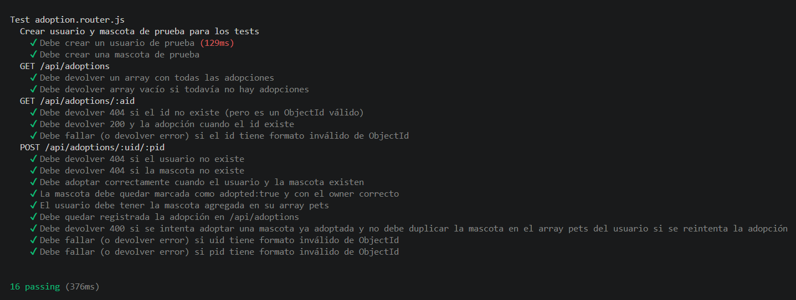

# RecursosBackend-Adoptme

## Proyecto Final para el curso Programación Backend (III): Testing y Escalabilidad de CoderHouse

Fernando F. Salomón

API REST desarrollada con Node.js y Express para la gestión de un sistema de adopción de mascotas. Permite administrar usuarios, mascotas, adopciones y sesiones (registro, login y autenticación mediante JWT).

## Tecnologías

- **Node.js** + **Express** — servidor y enrutamiento HTTP
- **MongoDB** + **Mongoose** — persistencia de datos
- **JSON Web Token (jsonwebtoken)** — autenticación basada en tokens
- **bcrypt** — hasheo de contraseñas
- **Multer** — carga de imágenes
- **cookie-parser** — manejo de cookies
- **dotenv** — variables de entorno
- **Mocha / Chai / Supertest** — testing

## Arquitectura del proyecto

El proyecto sigue una arquitectura en capas (patrón Repository/DAO) para desacoplar la lógica de negocio del acceso a datos:

```
Router → Controller → Service (Repository) → DAO → Model (Mongoose)
```

- **Routes**: definen los endpoints y los asocian a un controlador.
- **Controllers**: manejan la request/response HTTP y las validaciones básicas.
- **Services (Repository)**: exponen una interfaz genérica (`GenericRepository`) reutilizada por cada entidad (Users, Pets, Adoptions).
- **DAO**: encapsulan las operaciones concretas contra la base de datos (Mongoose).
- **Models**: definen los esquemas de Mongoose.
- **DTO**: transforman los datos de entrada/salida (por ejemplo, el payload del token o el modelo de creación de una mascota).

## Instalación

Cloná el repositorio y ubicate en la rama `develop`:

```bash
git clone https://github.com/fernandosalomon/RecursosBackend-Adoptme.git
cd RecursosBackend-Adoptme
```

Instalá las dependencias:

```bash
npm install
```

## Variables de entorno

Creá un archivo `.env` en la raíz del proyecto con las siguientes variables:

```env
PORT=8080
MONGO_URI=<tu_cadena_de_conexión_de_mongodb>
MONGO_URI_TEST=<tu_cadena_de_conexión_de_mongodb_para_testing>
```

## Uso

Iniciar el servidor:

```bash
npm start
```

Iniciar en modo desarrollo (con recarga automática ante cambios):

```bash
npm run dev
```

Por defecto el servidor corre en `http://localhost:8080` (o el puerto definido en `PORT`).

## Estructura de carpetas

```
src/
├── app.js                     # Punto de entrada, configuración de Express y conexión a Mongo
├── controllers/                # Lógica de manejo de requests
│   ├── adoptions.controller.js
│   ├── pets.controller.js
│   ├── sessions.controller.js
│   └── users.controller.js
├── dao/                         # Acceso directo a la base de datos
│   ├── models/                  # Esquemas de Mongoose (User, Pet, Adoption)
│   ├── Adoption.js
│   ├── Pets.dao.js
│   └── Users.dao.js
├── dto/                          # Transformación de datos de entrada/salida
│   ├── Pet.dto.js
│   └── User.dto.js
├── middleware/
│   └── validation.js            # Validación de IDs de Mongo en los params
├── repository/                  # Capa de servicios/repositorios
│   ├── GenericRepository.js
│   ├── AdoptionRepository.js
│   ├── PetRepository.js
│   └── UserRepository.js
├── routes/                       # Definición de rutas por entidad
│   ├── adoption.router.js
│   ├── pets.router.js
│   ├── sessions.router.js
│   └── users.router.js
├── services/
│   └── index.js                 # Inyección de dependencias entre repository y dao
├── utils/
│   ├── index.js                  # Hasheo/validación de contraseñas y __dirname
│   └── uploader.js               # Configuración de Multer para imágenes
└── public/img/                   # Imágenes subidas de las mascotas

test/
└── supertest.test.js             # Tests de integración con Mocha, Chai y Supertest
```

## Endpoints de la API

### Usuarios — `/api/users`

| Método | Ruta    | Descripción                |
| ------ | ------- | -------------------------- |
| GET    | `/`     | Obtiene todos los usuarios |
| GET    | `/:uid` | Obtiene un usuario por ID  |
| PUT    | `/:uid` | Actualiza un usuario       |
| DELETE | `/:uid` | Elimina un usuario         |

### Mascotas — `/api/pets`

| Método | Ruta         | Descripción                         |
| ------ | ------------ | ----------------------------------- |
| GET    | `/`          | Obtiene todas las mascotas          |
| POST   | `/`          | Crea una mascota                    |
| POST   | `/withimage` | Crea una mascota con imagen adjunta |
| PUT    | `/:pid`      | Actualiza una mascota               |
| DELETE | `/:pid`      | Elimina una mascota                 |

### Adopciones — `/api/adoptions`

| Método | Ruta         | Descripción                                           |
| ------ | ------------ | ----------------------------------------------------- |
| GET    | `/`          | Obtiene todas las adopciones                          |
| GET    | `/:aid`      | Obtiene una adopción por ID                           |
| POST   | `/:uid/:pid` | Crea una adopción vinculando un usuario a una mascota |

### Sesiones — `/api/sessions`

| Método | Ruta                  | Descripción                                          |
| ------ | --------------------- | ---------------------------------------------------- |
| POST   | `/register`           | Registra un nuevo usuario                            |
| POST   | `/login`              | Inicia sesión y setea una cookie con JWT             |
| GET    | `/current`            | Devuelve el usuario actual a partir del JWT          |
| GET    | `/unprotectedLogin`   | Login alternativo sin protección de datos sensibles  |
| GET    | `/unprotectedCurrent` | Devuelve el usuario actual (variante sin protección) |

> Todas las respuestas siguen el formato `{ status, message, payload }`.

## Testing

El proyecto incluye tests de integración escritos con Mocha, Chai y Supertest:

```bash
npm test
```
Ejemplo de la ejecución de los test:


## Uso con Docker

La imagen del proyecto está publicada en Docker Hub: [fernandofsalomon/adoptme-image](https://hub.docker.com/repository/docker/fernandofsalomon/adoptme-image/general).

### Descargar la imagen

\`\`\`bash
docker pull fernandofsalomon/adoptme-image
\`\`\`

### Variables de entorno

El contenedor necesita las mismas variables que el proyecto en local. Podés usar el archivo `.env.docker` incluido en el repositorio:

\`\`\`env
PORT=8080
MONGO_URI=<tu_cadena_de_conexión_de_mongodb>
MONGO_URI_TEST=<tu_cadena_de_conexión_de_mongodb_para_testing>
\`\`\`

Requiere que `MONGO_URL` y `MONGO_URL_TEST` apunte a una base de Mongo accesible desde el contenedor.

### Ejecutar el contenedor

\`\`\`bash
docker run -d \\
--env-file .env.docker \\
-p 8080:8080 \\
fernandofsalomon/adoptme-image
\`\`\`

Verificá que quedó levantada:

\`\`\`bash
docker logs -f adoptme-backend
\`\`\`

La API queda disponible en `http://localhost:8080/api/...` y la documentación Swagger en `http://localhost:8080/api-docs`.

### Correr los tests dentro del contenedor

\`\`\`bash
docker exec -it adoptme-backend npm test
\`\`\`
